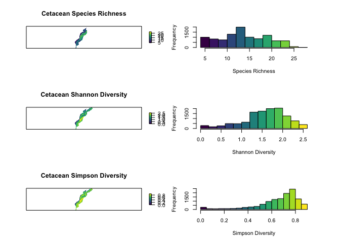
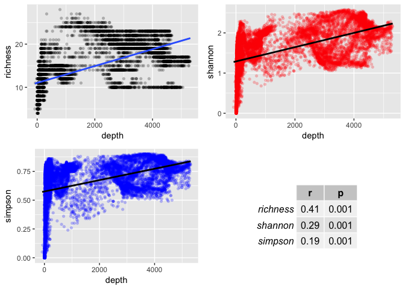

Comparing MDAT diversity metrics
================
emily shumchenia
01 December 2017

Intended audience and purpose
-----------------------------

This document is intended for [Northeast Ocean Data Portal](http://www.northeastoceandata.org) users. The purpose is to provide a plain-language explanation of the similarities and differences between marine life diversity data products developed by the [Marine life Data & Analysis Team (MDAT)](http://seamap.env.duke.edu/models/mdat/).

### Take-home message

> If you are concerned about accounting for and considering rare species, **SPECIES RICHNESS** does the best job, by representing every species equally, regardless of abundance
>
> If you care about rare species, but need to give some additional consideration to species that are particularly abundant, the **SHANNON INDEX** does a good job
>
> If abundant or dominant species are important for your analysis, the **SIMPSON INDEX** gives more weight to highly abundant species, to the detriment of the representation of the rarest species
>
> **EACH DIVERSITY METRIC** may respond differently to ecological features. If you care about a specific habitat type or ecological component, you may want to examine the behavior of all three metrics to help select the most responsive measure.

How we arrived at these conclusions
-----------------------------------

### Introduction

What are diversity metrics?

When most people think about diversity, they think about the total number of species in an area. However, the total number of species is a metric called [Species Richness](https://en.wikipedia.org/wiki/Species_richness).

[Diversity indices](https://en.wikipedia.org/wiki/Diversity_index) are more complex metrics that take the total number of species *and* their abundances into account (in different ways, depending on the index).

Experts in the region have indicated that each metric is valuable for different reasons.

Because each metric integrates information differently, it is important to know how they are similar or different, and how the outputs could be used.

------------------------------------------------------------------------

MDAT has developed diversity data products using three different metrics: [Species Richness](https://en.wikipedia.org/wiki/Species_richness), the [Shannon index](https://en.wikipedia.org/wiki/Diversity_index#Shannon_index), and the [Simpson index](https://en.wikipedia.org/wiki/Diversity_index#Simpson_index). To know how and when each metric could be used, we asked the following questions:

1.  Are the metrics similar or different?
2.  How do their results compare to one another?
3.  Do the metrics represent ecological patterns similarly?

Below are the maps maps and data for Species Richness, Shannon Diversity, and Simpson Diversity for all cetacean species that we will use to help answer these questions.

### QUESTION: Are the metrics similar or different?

**ANSWER:** From the maps and histograms we can tell that Shannon and Simpson are more similar to each other than either of them are to Species Richness. We can check this by doing a simple correlation between each pair of metrics (a value of 1.00 = a perfect correlation):

|          |  richness|  shannon|  simpson|
|----------|---------:|--------:|--------:|
| richness |      1.00|     0.56|     0.49|
| shannon  |      0.56|     1.00|     0.96|
| simpson  |      0.49|     0.96|     1.00|

This result is not surprising since both Shannon and Simpson indices consider abundance information, and Species Richness does not.

### QUESTION: How do the metrics' results compare to one another?

We know that results for Species Richness are quite different from both Shannon and Simpson results. To understand differences in the results of these two indices (how each deals differently with abundance information), we can plot the Shannon and Simpson results together. The plot below shows how abundance information at each location has contributed to each diversity index value for that location:

\[insert plot from Jesse\]

**ANSWER:** This plot shows that for low to medium abundance values, both the Shannon Index and Simpson indices generate comparable diversity results. However, for high abundance values, the Simpson index generates a proportionally much higher diversity value than the Shannon index.

This result indicates that the Simpson index gives more weight to highly abundant species than the Shannon index. The Shannon index treats rare species and dominant species more equally.

### QUESTION: Do the metrics represent ecological patterns similarly?

We know that depth is an important habitat variable for cetaceans - certain groups of species spend more time in deeper water, while other species have more coastal distributions.

If each diversity metric integrated information in a similar way, we would expect each metric to represent cetacean diversity similarly across different ocean habitats. In other words, each metric will respond in the same way to changes in depth.

A linear regression of each diveristy metric on water depth will help explain whether the three metrics respond similarly to real changes in cetacean diversity that likely occur with depth.

**ANSWER:** While the general response of each metric to depth is similar (all show increasing diversity with depth), the strength of each relationship is different. In this case, Species Richness is most responsive to changes in depth.

Back to [Take-home message](#take-home-message)
