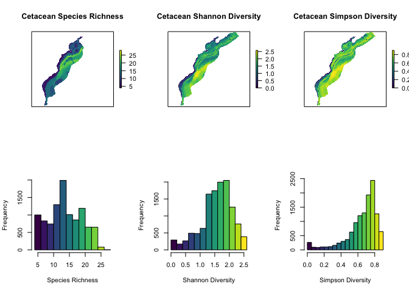

Comparing MDAT diversity metrics
================
emily shumchenia
30 November 2017

Take-home message
-----------------

> If you are concerned about accounting for and considering rare species, **SPECIES RICHNESS** does the best job, by representing every species equally, regardless of abundance
>
> If you care about rare species, but need to give some additional consideration to species that are particularly abundant, the **SHANNON INDEX** does a good job
>
> If abundant or dominant species are important for your analysis, the **SIMPSON INDEX** gives more weight to highly abundant species, to the detriment of the representation of the rarest species

Introduction
------------

What are diversity metrics?

When most people think about diversity, they think about the total number of species in an area. However, the total number of species is actually a metric called Species Richness.

Diversity indices take the total number of species *and* their abundances into account (in different ways, depending on the index).

Because each metric integrates information differently, it is important to know how they are similar or different, and how the outputs could be used.

Purpose
-------

MDAT has represented diversity with three different metrics: Species Richness, the Shannon Index, and the Simpson Index. The purpose of this document is to explore a few questions about these metrics:

-   How are the metrics similar or different?
-   How do their results compare to each other?
-   Do they each capture similar ecological patterns?

Here are maps (top row) and histograms (bottom row) for Species Richness, Shannon Diversity, and Simpson Diversity for all cetacean species:

Quick comparison
----------------

From the maps and histograms we can tell that Shannon and Simpson are more similar to each other than either of them are to Species Richness. We can check this by doing a simple correlation between each pair of metrics:

|          |  richness|  simpson|  shannon|
|----------|---------:|--------:|--------:|
| richness |      1.00|     0.49|     0.56|
| simpson  |      0.49|     1.00|     0.96|
| shannon  |      0.56|     0.96|     1.00|

This result is not surprising since both Shannon and Simpson indices consider abundance information, and Species Richness does not.

Comparing numeric results
-------------------------

To delve more deeply into how each index deals with abundance information, we can plot the Shannon and Simpson results together, showing how abundance information at each location has contributed to each diversity index value for that location:

\[insert plot from Jesse\]

This plot shows that for low to medium abundance values, both the Shannon Index and Simpson index generate comparable diversity results. However, for high abundance values, the Simpson index generates a proportionally much higher diversity value than the Shannon index.

This result indicates that the Simpson index gives more weight to highly abundant species than the Shannon index. The Shannon index treats rare species and dominant species more equally.

Ecological relationships
------------------------

Does each metric represent diversity similarly across different ocean habitats? In other words, will each metric give us the same answer to the question: "which habitats have high diversity and which have lower diversity?"

An important cetacean habitat variable is depth. A linear regression of each diveristy metric on water depth will help explain whether the three metrics respond similarly to real changes in diversity that may occur with depth.

<table class="table table-striped" style="width: auto !important; margin-left: auto; margin-right: auto;">
<caption>
Linear regression with depth
</caption>
<thead>
<tr>
<th style="text-align:left;">
</th>
<th style="text-align:right;">
r
</th>
<th style="text-align:right;">
p
</th>
</tr>
</thead>
<tbody>
<tr>
<td style="text-align:left;">
richness
</td>
<td style="text-align:right;">
0.41
</td>
<td style="text-align:right;">
0.001
</td>
</tr>
<tr>
<td style="text-align:left;">
shannon
</td>
<td style="text-align:right;">
0.29
</td>
<td style="text-align:right;">
0.001
</td>
</tr>
<tr>
<td style="text-align:left;">
simpson
</td>
<td style="text-align:right;">
0.19
</td>
<td style="text-align:right;">
0.001
</td>
</tr>
</tbody>
</table>

